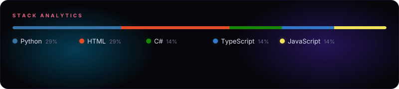

## About Me

I’m a software developer passionate about turning ideas and real-world problems into practical, scalable solutions. I enjoy working with technologies such as Java, C#, Git, and more, while continuously expanding my skills across software engineering, application development, and modern development practices. I believe in writing clean, maintainable code, learning through building, and treating every challenge as an opportunity to improve. My goal is to build software that is not only functional, but genuinely useful and impactful.

